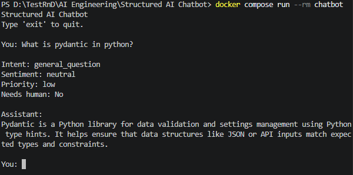

# Structured AI Chatbot

A minimal, beginner-friendly command-line chatbot that demonstrates how to
combine an LLM API with **Pydantic** to get reliable, structured responses
instead of raw, unpredictable text.



## What this project does

You type a message, it's sent to an LLM (DeepSeek), and instead of getting
back a plain sentence, the app gets back a small JSON object with:

- `message` — a reply to show you
- `intent` — what kind of request this is (`login_problem`, `billing`, ...)
- `sentiment` — how the user seems to feel
- `priority` — how urgent it is
- `needs_human` — whether a human should step in

That JSON is validated with Pydantic before the app trusts it in any way.

## What is Pydantic?

[Pydantic](https://docs.pydantic.dev/) is a Python library for defining the
*shape* of your data as a class, and then checking that real data actually
matches that shape. You write:

```python
class ChatResponse(BaseModel):
    message: str
    intent: Literal["general_question", "login_problem", ...]
    ...
```

and Pydantic will refuse (raise an error) anything that doesn't fit — a
missing field, a wrong type, or a value outside the allowed list. If it
doesn't raise an error, you can trust the object 100%.

## Why structured LLM output is useful

LLMs normally reply with free-form natural language, e.g. "I think this is a
login problem and the user sounds frustrated." A program can't reliably act
on a sentence like that — you'd need fragile string matching or regexes to
pull the "login problem" and "frustrated" parts back out.

Structured output flips this: we ask the LLM to reply in a fixed,
machine-readable format (JSON matching a schema) from the start. The
application can then read `response.intent` directly instead of guessing.

## How this differs from normal free-form text

| Free-form text | Structured output (this project) |
|---|---|
| "Looks like a login issue, they seem annoyed." | `{"intent": "login_problem", "sentiment": "frustrated", ...}` |
| Requires guessing/parsing to extract meaning | Already in a fixed, predictable shape |
| Wording can change between calls | Field names and allowed values are fixed by the schema |
| No guarantee of correctness | Pydantic guarantees the shape before the app uses it |

This project uses DeepSeek's **JSON mode**
(`response_format={"type": "json_object"}`), which is DeepSeek's native way
of forcing the model to output syntactically valid JSON — this is why we
never ask the model "please return JSON" and then hope for the best.

## How Pydantic validates the response

1. The LLM's raw reply is parsed from a JSON string into a Python `dict`
   using `json.loads(...)`.
2. That `dict` is passed into `ChatResponse.model_validate(data)`.
3. Pydantic checks every field exists, has the correct type, and (for
   `intent`, `sentiment`, `priority`) is one of the allowed values.
4. If anything is wrong, Pydantic raises a `ValidationError` that the app
   catches and reports clearly, instead of crashing or silently using bad
   data.
5. If validation succeeds, you get back a real `ChatResponse` Python object
   with autocomplete-friendly, type-checked fields.

See [`app/models.py`](app/models.py) and [`app/llm.py`](app/llm.py) for the
exact code, which is commented to walk through each step.

## Project structure

```text
structured-ai-chatbot/
│
├── app/
│   ├── __init__.py
│   ├── main.py      # CLI loop: gets user input, prints the result
│   ├── models.py     # The Pydantic ChatResponse schema
│   └── llm.py        # Calls the LLM and returns a validated ChatResponse
│
├── .env.example
├── .gitignore
├── .dockerignore
├── Dockerfile
├── requirements.txt
└── README.md
```

## Installing dependencies

Requires Python 3.11+.

```bash
python -m venv .venv
source .venv/bin/activate   # on Windows: .venv\Scripts\activate
pip install -r requirements.txt
```

## Configuring the API key

This project uses the [DeepSeek API](https://api-docs.deepseek.com/), which
is compatible with the official `openai` Python SDK (only the `base_url` is
different).

1. Get an API key from the [DeepSeek platform](https://platform.deepseek.com/).
2. Copy the example env file:

   ```bash
   cp .env.example .env
   ```

3. Open `.env` and set your key:

   ```text
   LLM_API_KEY=your_api_key_here
   ```

The API key is never hardcoded — it's loaded from the environment via
`python-dotenv`.

## Running the chatbot

```bash
python -m app.main
```

## Running with Docker

Build the image:

```bash
docker build -t structured-ai-chatbot .
```

Run it interactively (the chatbot reads input from your terminal, so `-it`
is required), passing your `.env` file for the API key:

```bash
docker run --rm -it --env-file .env structured-ai-chatbot
```

Or with Docker Compose, which reads `.env` automatically via `docker-compose.yml`:

```bash
docker compose run --rm chatbot
```

## Example interaction

```text
Structured AI Chatbot
Type 'exit' to quit.

You: I can't log into my account and I've tried three times.

Intent: login_problem
Sentiment: frustrated
Priority: medium
Needs human: No

Assistant:
I can help you troubleshoot your login issue.
```

## Architecture

```text
User Input
    ↓
LLM API (DeepSeek, JSON mode)
    ↓
Structured Response (JSON string)
    ↓
Pydantic Validation (ChatResponse.model_validate)
    ↓
ChatResponse object
    ↓
Application (prints fields to the user)
```

## Error handling

The app handles these cases with clear, beginner-friendly messages:

- **Missing API key** — `MissingAPIKeyError` raised before any API call is made.
- **API failure** — network errors and DeepSeek API errors (bad key, rate
  limit, etc.) are caught and reported without crashing the app.
- **Invalid structured response** — if the LLM's reply isn't valid JSON, or
  doesn't match the `ChatResponse` schema, `InvalidStructuredResponseError`
  is raised with details, and the chat loop continues.
- **Unexpected exceptions** — a final catch-all in `main.py` prevents any
  single bad turn from crashing the whole session.

## Practice exercises

1. **Add a field.** Add a `follow_up_question: str | None` field to
   `ChatResponse` that the LLM can fill in when it needs more information.
   Update `models.py` and `main.py` to display it.
2. **Add a new intent.** Add `"feature_request"` to the `intent` `Literal`
   in `models.py`, then test it by asking the chatbot to "suggest a new
   feature."
3. **Break it on purpose.** Temporarily change `intent` in `models.py` to
   only allow `Literal["billing"]` and see the `ValidationError` Pydantic
   raises when the LLM picks a different intent. This shows you exactly what
   Pydantic is protecting you from.
4. **Add a constrained number.** Add a `confidence: float` field (0.0–1.0)
   to `ChatResponse` using Pydantic's `Field(ge=0.0, le=1.0)`, and print it
   in `main.py`.
5. **Write a standalone validation script.** Outside of `main.py`, write a
   small script that takes a hardcoded JSON string (not from the LLM) and
   tries to validate it with `ChatResponse.model_validate_json(...)`. Try it
   with both valid and intentionally broken JSON to see Pydantic's error
   messages first-hand.
